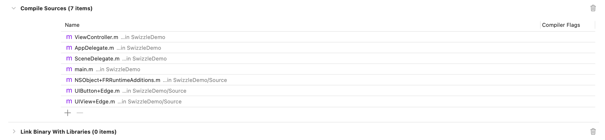
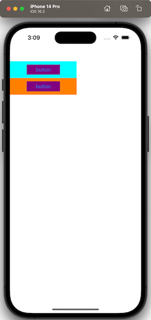
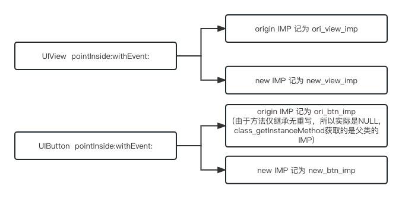
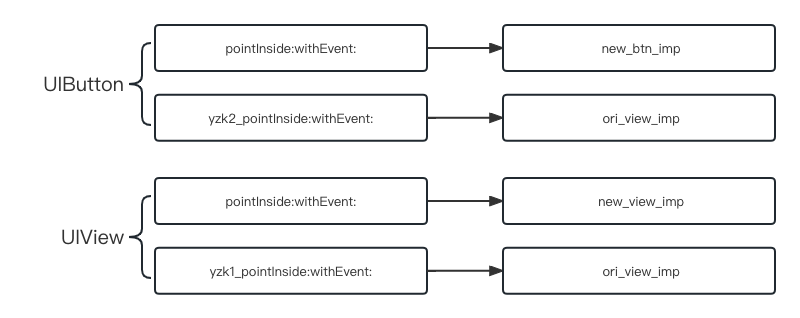
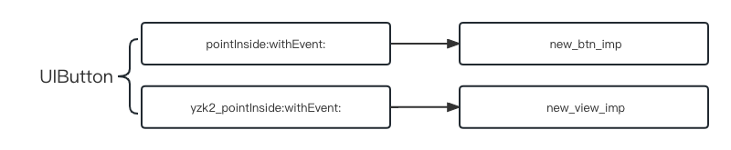

# iOS method swizzle 注意事项

### 概述

iOS中，runtime方法交换，这个相信同学们都不陌生，原理也有很多文章讲解过了，本文就不在讲解了。

这里只是列举几个可能会出现的问题，带着同学们分析问题的原因，以及如何处理。同学们可以先看问题，自行分析一下原因以及如何处理。

下文所用 [Demo github链接](https://github.com/whlpkk/MethodSwizzle)。

### 问题

项目中有个UIView的Category，通过runtime添加了一个新的属性`UIEdgeInsets yzk_responseEdge1`，然后通过method swizzle 重写了`pointInside:(CGPoint)point withEvent:(UIEvent *)event`方法，用于扩大点击事件。

再另一个工具库中，同样有个UIButton的Category，通过runtime添加了一个新的属性`UIEdgeInsets yzk_responseEdge2`，然后通过method swizzle 重写了`pointInside:(CGPoint)point withEvent:(UIEvent *)event`方法，用于扩大点击事件。

当我们使用UIButton或其子类的时候，预期是`yzk_responseEdge1`或`yzk_responseEdge2`都可以生效。实际上，仅仅有`yzk_responseEdge2`生效。

这里附上Demo的核心代码，全部逻辑可自行下载Demo。

* 方法交换的逻辑，熟悉的同学可以跳过这段代码。

```objective-c
// NSObject+FRRuntimeAdditions.h
@interface NSObject (FRRuntimeAdditions)
+ (void)swizzleInstanceMethod:(SEL)originalSEL with:(SEL)replacementSEL;
+ (void)swizzleClassMethod:(SEL)originalSEL with:(SEL)replacementSEL;
@end

  
// NSObject+FRRuntimeAdditions.m
void class_swizzleInstanceMethod(Class class, SEL originalSEL, SEL replacementSEL)
{
    //class_getInstanceMethod()，如果子类没有实现相应的方法，则会返回父类的方法。
    Method originMethod = class_getInstanceMethod(class, originalSEL);
    Method replaceMethod = class_getInstanceMethod(class, replacementSEL);
    
    //class_addMethod() 判断originalSEL是否在子类中实现，如果只是继承了父类的方法，没有重写，那么直接调用method_exchangeImplementations，则会交换父类中的方法和当前的实现方法。此时如果用父类调用originalSEL，因为方法已经与子类中调换，所以父类中找不到相应的实现，会抛出异常unrecognized selector.
    //当class_addMethod() 返回YES时，说明子类未实现此方法(根据SEL判断)，此时class_addMethod会添加（名字为originalSEL，实现为replaceMethod）的方法。此时在将replacementSEL的实现替换为originMethod的实现即可。
    //当class_addMethod() 返回NO时，说明子类中有该实现方法，此时直接调用method_exchangeImplementations交换两个方法的实现即可。
    //注：如果在子类中实现此方法了，即使只是单纯的调用super，一样算重写了父类的方法，所以class_addMethod() 会返回NO。
    
    if(class_addMethod(class, originalSEL, method_getImplementation(replaceMethod),method_getTypeEncoding(replaceMethod)))
    {
        class_replaceMethod(class,replacementSEL, method_getImplementation(originMethod), method_getTypeEncoding(originMethod));
    }else {
        method_exchangeImplementations(originMethod, replaceMethod);
    }
}

void class_swizzleClassMethod(Class class, SEL originalSEL, SEL replacementSEL)
{
    //类方法实际上是储存在类对象的类(即元类)中，即类方法相当于元类的实例方法,所以只需要把元类传入，其他逻辑和交互实例方法一样。
    Class class2 = object_getClass(class);
    class_swizzleInstanceMethod(class2, originalSEL, replacementSEL);
}

@implementation NSObject (FRRuntimeAdditions)

+ (void)swizzleInstanceMethod:(SEL)originalSEL with:(SEL)replacementSEL {
    class_swizzleInstanceMethod(self, originalSEL, replacementSEL);
}

+ (void)swizzleClassMethod:(SEL)originalSEL with:(SEL)replacementSEL {
    class_swizzleClassMethod(self, originalSEL, replacementSEL);
}

@end
```

* UIView的Category

```objective-c
// UIView+Edge.h
@interface UIView (Edge)
@property (nonatomic, assign) UIEdgeInsets yzk_responseEdge1;
@end
  
// UIView+Edge.m
@implementation UIView (Edge)
+ (void)load {
    [self swizzleInstanceMethod:@selector(pointInside:withEvent:)
                           with:@selector(yzk_pointInside:withEvent:)];
}

- (void)setYzk_responseEdge1:(UIEdgeInsets)yzk_responseEdge1 {
    objc_setAssociatedObject(self, @selector(yzk_responseEdge1), [NSValue valueWithUIEdgeInsets:yzk_responseEdge1], OBJC_ASSOCIATION_RETAIN_NONATOMIC);
}

- (UIEdgeInsets)yzk_responseEdge1 {
    NSValue *value = objc_getAssociatedObject(self, _cmd);
    return value ? [value UIEdgeInsetsValue] : UIEdgeInsetsZero;
}

- (BOOL)yzk_pointInside:(CGPoint)point withEvent:(nullable UIEvent *)event {
    BOOL inside = [self yzk_pointInside:point withEvent:event];
    if (inside) {
        return YES;
    }

    CGRect hitFrame = UIEdgeInsetsInsetRect(self.bounds, self.yzk_responseEdge1);
    return CGRectContainsPoint(hitFrame, point);
}
@end
```

* UIButton的Category

``` objective-c
// UIButton+Edge.h
@interface UIButton (Edge)
@property (nonatomic, assign) UIEdgeInsets yzk_responseEdge2;
@end

// UIButton+Edge.m
@implementation UIButton (Edge)
+ (void)load {
    [self swizzleInstanceMethod:@selector(pointInside:withEvent:)
                           with:@selector(yzk2_pointInside:withEvent:)];
}

- (void)setYzk_responseEdge2:(UIEdgeInsets)yzk_responseEdge2 {
    objc_setAssociatedObject(self, @selector(yzk_responseEdge2), [NSValue valueWithUIEdgeInsets:yzk_responseEdge2], OBJC_ASSOCIATION_RETAIN_NONATOMIC);
}

- (UIEdgeInsets)yzk_responseEdge2 {
    NSValue *value = objc_getAssociatedObject(self, _cmd);
    return value ? [value UIEdgeInsetsValue] : UIEdgeInsetsZero;
}

- (BOOL)yzk2_pointInside:(CGPoint)point withEvent:(nullable UIEvent *)event {
    BOOL inside = [self yzk2_pointInside:point withEvent:event];
    if (inside) {
        return YES;
    }
    CGRect hitFrame = UIEdgeInsetsInsetRect(self.bounds, self.yzk_responseEdge2);
    return CGRectContainsPoint(hitFrame, point);
}
@end
```

* Controller中创建2个UIButton，分别使用不同的属性，测试效果

``` objective-c
@implementation ViewController

- (void)viewDidLoad {
    [super viewDidLoad];
    
    UIView *view1 = [[UIView alloc] initWithFrame:CGRectMake(0, 100, 200, 50)];
    view1.backgroundColor = [UIColor cyanColor];
    [self.view addSubview:view1];
    
    UIView *view2 = [[UIView alloc] initWithFrame:CGRectMake(0, 150, 200, 50)];
    view2.backgroundColor = [UIColor orangeColor];
    [self.view addSubview:view2];
    
    UIButton *bt1 = [UIButton buttonWithType:UIButtonTypeSystem];
    bt1.frame = CGRectMake(50, 10, 100, 30);
    bt1.backgroundColor = [UIColor purpleColor];
    bt1.yzk_responseEdge1 = UIEdgeInsetsMake(-10, -50, -10, -50);
    [bt1 setTitle:@"button" forState:UIControlStateNormal];
    [bt1 addTarget:self action:@selector(btn1Click) forControlEvents:UIControlEventTouchUpInside];
    [view1 addSubview:bt1];
    
    UIButton *bt2 = [UIButton buttonWithType:UIButtonTypeSystem];
    bt2.frame = CGRectMake(50, 10, 100, 30);
    bt2.backgroundColor = [UIColor purpleColor];
    bt2.yzk_responseEdge2 = UIEdgeInsetsMake(-10, -50, -10, -50);
    [bt2 setTitle:@"button" forState:UIControlStateNormal];
    [bt2 addTarget:self action:@selector(btn2Click) forControlEvents:UIControlEventTouchUpInside];
    [view2 addSubview:bt2];
}

- (void)btn1Click {
    NSLog(@"button 1");
}

- (void)btn2Click {
    NSLog(@"button 2");
}

@end
```

工程中全部用到的文件如下：



Demo 效果如下：



当我们点击青色区域时，控制台没有任何log输出。当我们点击橙色区域时，控制台输出“button 2”。

这说明属性`yzk_responseEdge1`不生效，`yzk_responseEdge2`生效。

为什么会出现这种现象？如何修改才能达到我们的预期，使`yzk_responseEdge1`和`yzk_responseEdge2`均生效？

### 分析

首先我们从方法交换的流程开始分析。为了方便后文讲述，我们标记各IMP如下图



由于上图加载顺序，我们会优先加载UIButton的Category，即优先交换UIButton的方法。此时UIView尚未交换，所以此时`ori_btn_imp`为 `class_getInstanceMethod`获取到的父类`pointInside:withEvent:`实现，即`ori_view_imp`。

交换后结果如下：



所以当调用 UIButton及其子类 的 `pointInside:withEvent:` 方法时，会走入 `new_btn_imp`，即

``` objective-c
- (BOOL)yzk2_pointInside:(CGPoint)point withEvent:(nullable UIEvent *)event {
    BOOL inside = [self yzk2_pointInside:point withEvent:event];
    if (inside) {
        return YES;
    }
    CGRect hitFrame = UIEdgeInsetsInsetRect(self.bounds, self.yzk_responseEdge2);
    return CGRectContainsPoint(hitFrame, point);
}
```

当调用 `yzk2_pointInside:withEvent:` 方法时，会走入 `ori_view_imp`，即系统的默认实现，大致逻辑如下：

```objective-c
- (BOOL)pointInside:(CGPoint)point withEvent:(UIEvent *)event {
    return CGRectContainsPoint(self.bounds, point);
}
```

所以这里并不会调用 `new_view_imp`，所以对UIView 的hook没有生效。

### 解决方案

这里作者有2种解决方案，欢迎大家在评论区补充更好的方案。

* 第一种方案：

  调整Category的加载顺序，优先交换UIView的方法。UIButton交换时，`ori_btn_imp`为 `class_getInstanceMethod`获取到的父类`pointInside:withEvent:`实现，即 `new_view_imp`。经过交换后结果如下，
  
  
  
  当调用UIButton及其子类 的 `pointInside:withEvent:` 方法时
  
  * 调用 `new_btn_imp`。
  * 调用`yzk2_pointInside:withEvent:` 方法
  * 调用 `new_view_imp`
  
  此时设置`yzk_responseEdge1`和`yzk_responseEdge2`均可生效。
  
  缺点：加载顺序不方便维护。
  
* 第二种方案：

  给 UIButton `pointInside:withEvent:` 添加一个实现，例如：
  
  ``` objective-c
  - (BOOL)pointInside:(CGPoint)point withEvent:(UIEvent *)event {
      return [super pointInside:point withEvent:event];
  }
  ```
  
  注意尽管方法里面没有任何逻辑，单纯调用`super`，依然和未实现方法有区别。UIButton交换时，获取到的`ori_btn_imp`为我们这里新写的实现。
  
  当调用UIButton及其子类 的 `pointInside:withEvent:` 方法时
  
  * 调用 `new_btn_imp`。
  * 调用`yzk2_pointInside:withEvent:` 方法
  * 调用 `ori_btn_imp`，即我们新添加的实现。
  * 调用 UIView 的`pointInside:withEvent:` 方法
  * 调用 `new_view_imp`。
  
  优点：加载顺序不会影响结果。
  
  缺点：由Category复写主类方法，多Category复写同一方法可能造成隐患。

### 总结

method swizzle 的过程中，交换的顺序，子类是否实现方法，都会影响到最终的调用结果。

如果想更深入了解的小伙伴，可以去看 [Objective-C-Method-Swizzling](http://yulingtianxia.com/blog/2017/04/17/Objective-C-Method-Swizzling/) 这篇文章。